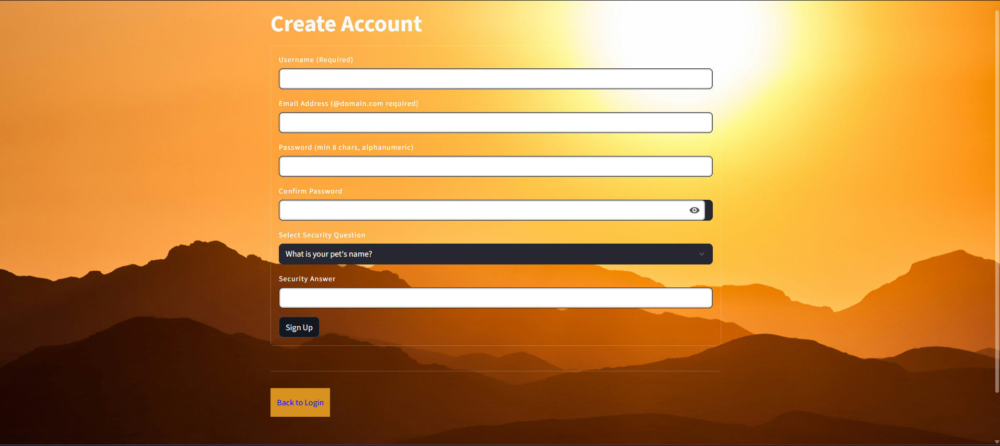
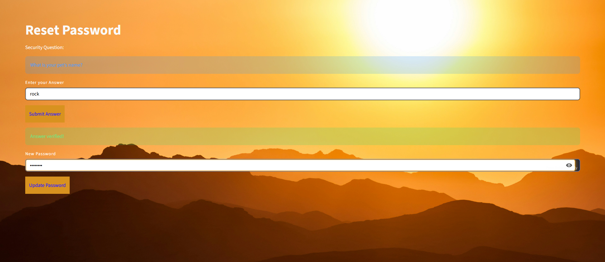
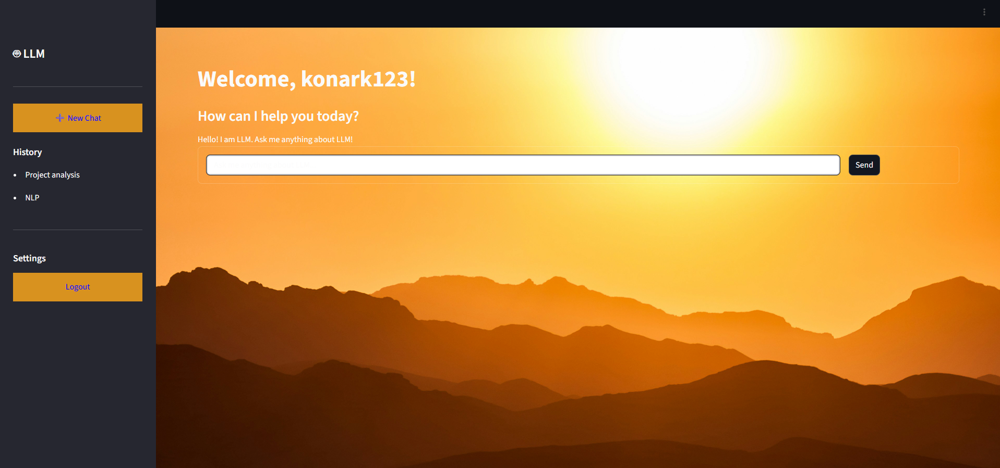

# Milestone 1 – User Authentication Module

## Overview
This milestone focuses on developing the user login module using Streamlit.

## Features
- Simple login interface
- Built using Streamlit
- Deployed using ngrok for public access

## Files Included
- app.py – Streamlit login application
- colab.ipynb – Development notebook
- requirements.txt – Required libraries

## How to Run
1. Install dependencies:
   pip install -r requirements.txt
2. Run the app:
   streamlit run app.py

## Screenshots

### Login Page

### Invalid Credentials

### Create Account

### Reset Password

### Main Page After Login

